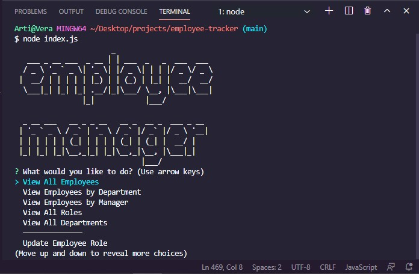

# Employee Tracker

A simple command-line interface for keeping track of employees, roles, and departments.  
  
[Demo Video](https://www.youtube.com/watch?v=RsI-hHDpm6I)  
  
Uses [inquirer](https://www.npmjs.com/package/inquirer) for menus and input, and interacts with tables for employees, roles, and departments in a database.

The complicated joins to do things like display all employees by manager were unexpectedly fun, once the syntax was nailed down. 

The biggest challenge was trying to get inquirer to interact with the database info within the questions--the choices for the prompts about updating role, manager, etc. should populate from the relevant table, but getting them there was extremely challenging. Something for future development.  
  
